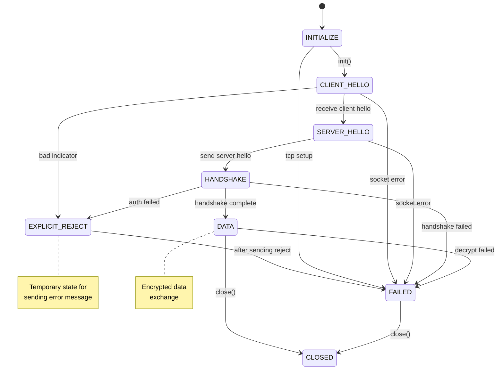
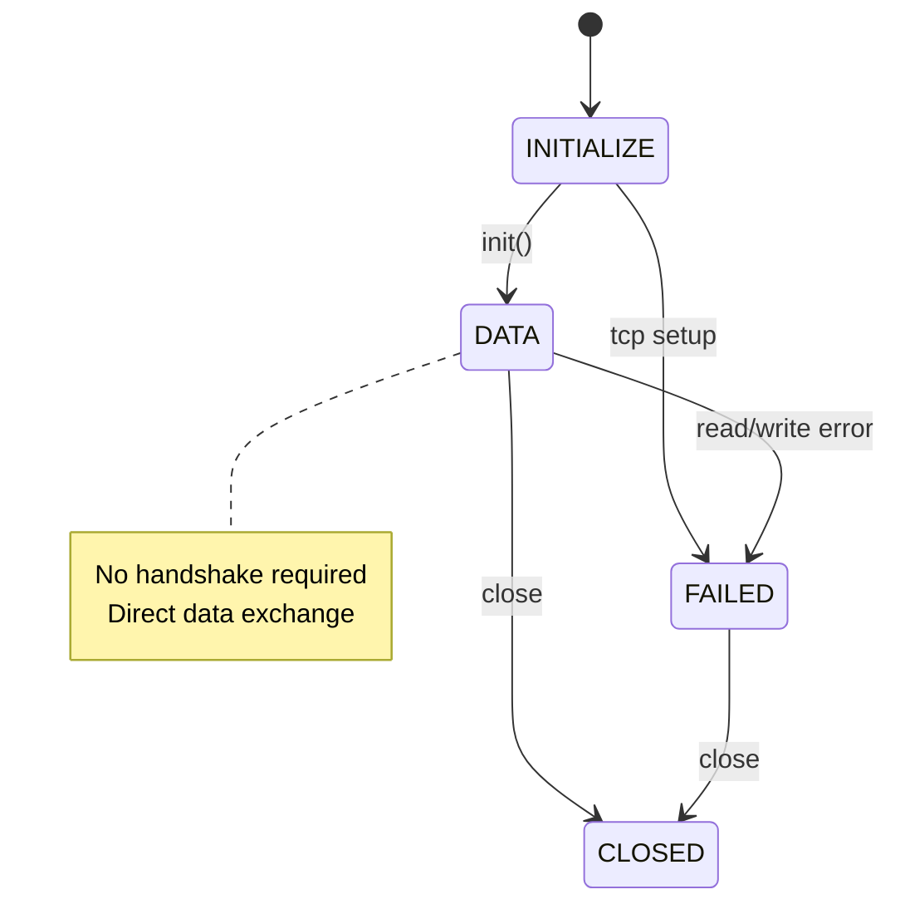

# ESPHome API Protocol Details

This document describes the low-level protocol formats used by the ESPHome API, including message framing, buffer layouts, and wire formats for both Noise and Plaintext protocols.

## Overview

The ESPHome API supports two protocol variants:

1. **Noise Protocol**: Encrypted communication using the Noise protocol framework

2. **Plaintext Protocol**: Unencrypted communication with variable-length encoding

Both protocols use protocol buffers for message serialization but differ in their framing and transport layer.

## Common Elements

### Message Types

- Message types are encoded as 16-bit unsigned values (two bytes)
- Split into `type_high` (upper byte) and `type_low` (lower byte)
- Allows for 65,536 different message types (0-65535)

### VarInt Encoding

Variable-length integer encoding follows the [Protocol Buffers VarInt specification](https://protobuf.dev/programming-guides/encoding/):

- Each byte has a continuation bit (MSB)
- 7 bits of data per byte
- Least significant bits first
- Always encodes unsigned values

Size ranges:

- 1 byte: 0-127
- 2 bytes: 128-16,383
- 3 bytes: 16,384-2,097,151
- 4 bytes: 2,097,152-268,435,455
- 5 bytes: 268,435,456-34,359,738,367

## Noise Protocol

### Overview

The Noise protocol provides encrypted, authenticated communication using the [Noise XX handshake pattern](https://www.noiseprotocol.org/noise.html#interactive-handshake-patterns-fundamental).

### Frame Structure

```
[Indicator][Encrypted Size][Encrypted Payload][MAC]
    1 byte      2 bytes         Variable      16 bytes
```

### Message Format

1. **Unencrypted Header** (3 bytes):
   - Indicator: 0x01
   - Encrypted payload size: 16-bit unsigned, big-endian

2. **Encrypted Payload**:
   - Message type: 16-bit unsigned, big-endian (encrypted)
   - Data length: 16-bit unsigned, big-endian (encrypted)
   - Protocol buffer data

3. **MAC** (16 bytes)

### Data Type Summary

| Field | Type | Size | Encoding | Notes |
|-------|------|------|----------|-------|
| Indicator | uint8 | 1 byte | - | Always 0x01 |
| Encrypted Size | uint16 | 2 bytes | Big-endian | Not encrypted |
| Message Type | uint16 | 2 bytes | Big-endian | Encrypted |
| Data Length | uint16 | 2 bytes | Big-endian | Encrypted |
| Data | bytes | Variable | - | Protocol buffer payload, encrypted |

### Buffer Layout

```
Position:  [0] [1] [2] [3] [4] [5] [6] [7]  ...  [N-15] ... [N]
Content:   Ind ES₁ ES₂ MT₁ MT₂ DL₁ DL₂ [Payload Data] [MAC-16-bytes]
           └─────── Header (7 bytes) ──────┘           └─ Footer ─┘
```

Where:

- `Ind`: Indicator byte (0x01 for Noise)
- `ES₁/ES₂`: Encrypted payload size (16-bit unsigned, big-endian)
- `MT₁/MT₂`: Message type (16-bit unsigned, big-endian, encrypted)
- `DL₁/DL₂`: Data length (16-bit unsigned, big-endian, encrypted)
- `Payload`: Actual message data (encrypted)
- `MAC`: 16-byte authentication tag

### Encryption Details

- Uses ChaCha20-Poly1305 AEAD cipher
- Encrypts: message type + data length + payload
- The encrypted size field in the header is NOT encrypted
- MAC provides authentication for the entire encrypted payload

### State Machine

The Noise protocol uses the following states:



States:

1. **INITIALIZE**: Initial state, waiting for init() to be called
2. **CLIENT_HELLO**: Waiting for client hello message
3. **SERVER_HELLO**: Sending server hello with device info
4. **HANDSHAKE**: Performing Noise XX handshake exchange
5. **DATA**: Handshake complete, ready for encrypted data exchange
6. **CLOSED**: Connection closed normally
7. **FAILED**: Error occurred, connection failed
8. **EXPLICIT_REJECT**: Temporary state for sending handshake rejection

### Handshake Process

During the Noise handshake, the server sends a SERVER_HELLO message:

```
SERVER_HELLO format:
[Indicator] [Size] [Protocol] [Node-Name] [MAC-Address]
    0x01      2B      0x01     null-term    null-term
```

Example SERVER_HELLO:

```
Hex: 01 00 1C 01 65 73 70 68 6F 6D 65 00 31 32 3A 33 34 3A 35 36 3A 37 38 3A 39 41 3A 42 43 00
     ^  ^^^^^ ^  ^--------node------^ ^  ^-----------------MAC address--------------------^ ^
     |    |   |                       |                                                     |
     |    |   Protocol (0x01)         null                                                  null
     |    Size (28 bytes, big-endian)
     Indicator (0x01)
```

This decodes to:

- Frame indicator: 0x01
- Frame size: 0x001C (28 bytes)
- Protocol: 0x01 (always)
- Node name: "esphome" (null-terminated)
- MAC: "12:34:56:78:9A:BC" (null-terminated)

During the actual Noise handshake phase, if errors occur, the server sends an explicit handshake rejection:

```
Handshake rejection format:
[Indicator] [Size] [Error-Flag] [Error-Message]
    0x01      2B      0x01         Variable
```

Example handshake rejection:

```
Hex: 01 00 17 01 48 61 6E 64 73 68 61 6B 65 20 4D 41 43 20 66 61 69 6C 75 72 65
     ^  ^^^^^ ^  ^----------------------Error message------------------------^
     |    |   |
     |    |   Error flag (0x01)
     |    Size (23 bytes, big-endian)
     Indicator (0x01)
```

This decodes to:

- Frame indicator: 0x01
- Frame size: 0x0017 (23 bytes)
- Error flag: 0x01 (failure)
- Error message: "Handshake MAC failure" (NOT null-terminated)

### Error Handling

Handshake errors can occur during different phases:

1. **CLIENT_HELLO phase**: Bad indicator or packet length
2. **HANDSHAKE phase**: Authentication failures, MAC failures, protocol errors

When these errors occur, the server sends an explicit rejection message using the format above, then transitions to the FAILED state.

Actual handshake error messages sent:

- "Bad indicator byte" - Invalid frame indicator
- "Bad handshake packet len" - Packet too large for handshake phase
- "Empty handshake message" - Received empty handshake frame
- "Bad handshake error byte" - Invalid error byte in handshake message
- "Handshake MAC failure" - MAC verification failed during handshake
- "Handshake error" - Generic handshake failure

For post-handshake errors (during encrypted data exchange):

- MAC verification failures close the connection immediately
- Invalid frame structure closes the connection immediately
- No error messages are sent for these failures to prevent information leakage

### Wire Format Example

Sending a temperature reading (value: 23.5°C):

```
Hex: 01 00 0E 00 08 00 06 12 04 08 96 42 10 B4 46
     [C H A C H A 2 0 - P O L Y  M A C - 1 6 bytes]
```

- `01`: Noise indicator
- `00 0E`: Encrypted size (14 bytes, big-endian unsigned)
- Encrypted payload (before encryption):
  - `00 08`: Message type 8 (big-endian unsigned)
  - `00 06`: Data length 6 (big-endian unsigned)
  - `12 04 08 96 42 10`: Protocol buffer data
- 16-byte MAC appended

## Plaintext Protocol

### Overview

The plaintext protocol uses variable-length encoding to minimize overhead for unencrypted communication.

### State Machine

The plaintext protocol uses a simpler state machine:



States:

1. **INITIALIZE**: Initial state, waiting for init() to be called
2. **DATA**: Ready for data exchange (no handshake required)
3. **CLOSED**: Connection closed normally
4. **FAILED**: Error occurred, connection failed

No handshake is required for the plaintext protocol - it transitions directly to the DATA state after initialization.

### Frame Structure

```
[Indicator][Payload Size VarInt][Message Type VarInt][Payload]
    1 byte       1-3 bytes           1-2 bytes       Variable
```

### Data Type Summary

| Field | Type | Size | Encoding | Notes |
|-------|------|------|----------|-------|
| Indicator | uint8 | 1 byte | - | Always 0x00 |
| Payload Size | varint | 1-3 bytes | [VarInt](https://protobuf.dev/programming-guides/encoding/) | Unsigned |
| Message Type | varint | 1-2 bytes | [VarInt](https://protobuf.dev/programming-guides/encoding/) | Unsigned, max 65535 |
| Data | bytes | Variable | - | Protocol buffer payload |

### Message Format

1. **Indicator**: 0x00 (1 byte)
2. **Payload Size**: VarInt encoding of payload size (unsigned)
3. **Message Type**: VarInt encoding of the 16-bit message type (unsigned)
4. **Payload**: Protocol buffer data

### Buffer Layout

The plaintext protocol dynamically adjusts the header position to minimize padding:

#### Small Messages (header length = 3 bytes)

```
Position:  [0] [1] [2] [3] [4] [5] [6] ...
Content:   XX  XX  XX  Ind FSz MTp [Payload]
           └ Padding ┘ └── Header ──┘
           (offset=3)
```

#### Medium Messages (header length = 4 bytes)

```
Position:  [0] [1] [2] [3] [4] [5] [6] ...
Content:   XX  XX  Ind FS₁ FS₂ MTp [Payload]
           └Pad┘ └─── Header ────┘
         (offset=2)
```

#### Large Messages (header length = 6 bytes)

```
Position:  [0] [1] [2] [3] [4] [5] [6] ...
Content:   Ind FS₁ FS₂ FS₃ MT₁ MT₂ [Payload]
           └────── Header ───────┘
           (offset=0, no padding)
```

Where:

- `Ind`: Indicator byte (0x00 for plaintext)
- `FSz/FS₁/FS₂/FS₃`: Frame size varint (unsigned)
- `MTp/MT₁/MT₂`: Message type varint (unsigned)
- Padding bytes are unused (can be any value)

### VarInt Size Calculation

The plaintext protocol dynamically calculates the optimal header position to minimize unused padding:

1. **Payload Size Computation**: The payload size includes only the actual protobuf data bytes, not the header components. This differs from the Noise protocol which includes type and length in its data length field.

2. **VarInt Length Determination**: Based on the value being encoded:
   - Values 0-127: 1 byte
   - Values 128-16,383: 2 bytes
   - Values 16,384-2,097,151: 3 bytes
   - And so on (each additional byte adds 7 bits of capacity)

3. **Header Offset Calculation**: The header is positioned as late as possible in the 6-byte padding area:
   - Total header length = 1 (indicator) + payload size varint + message type varint
   - Offset = 6 - total header length
   - This ensures minimal unused bytes at the beginning of the buffer

4. **Dynamic Positioning**: As message sizes vary, the header position adjusts accordingly:
   - Small messages use offsets of 3-5 (leaving 3-5 unused bytes)
   - Large messages can use offset 0 (utilizing all padding bytes)

This dynamic positioning maximizes buffer efficiency while maintaining a fixed pre-allocation size.

### Wire Format Example

Same temperature reading:

```
Hex: 00 06 08 12 04 08 96 42 10
```

- `00`: Plaintext indicator
- `06`: Payload size (6 bytes, varint unsigned)
- `08`: Message type 8 (varint unsigned)
- `12 04 08 96 42 10`: Protocol buffer data

## Performance Considerations

### Noise Protocol

- Fixed 23-byte overhead (7 header + 16 MAC)
- Constant-time header construction
- Higher CPU usage for encryption
- Better for security-sensitive applications

### Plaintext Protocol

- Variable 3-5 byte overhead (depending on sizes)
- Dynamic header positioning
- Lower CPU usage
- Better for high-frequency, non-sensitive data

## Implementation Notes

1. **Integer Types**: All size and type fields are unsigned integers

2. **Endianness**:
   - Noise protocol: All multi-byte values use big-endian encoding
   - Plaintext protocol: Uses [VarInt encoding](https://protobuf.dev/programming-guides/encoding/) (Protocol Buffers standard)

3. **Buffer Alignment**: Both protocols ensure payload data starts at predictable offsets for efficient processing

4. **Error Handling**:
   - Invalid frame indicators or sizes should immediately close the connection
   - For Noise protocol specific errors (handshake failures, decryption errors, etc.), see the [Noise Protocol](#noise-protocol) section above

5. **Maximum Sizes**:
   - Message types: 0-65,535 (16-bit unsigned)
   - Frame/data sizes: up to 2^32-1 bytes (varint can encode up to 64-bit values, but practically limited by memory)