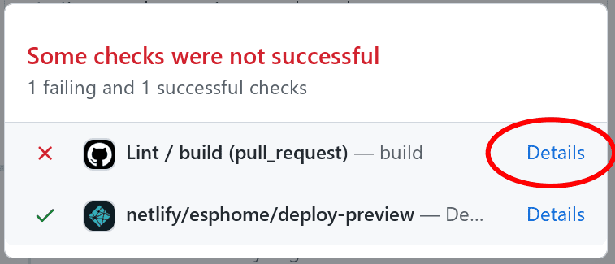
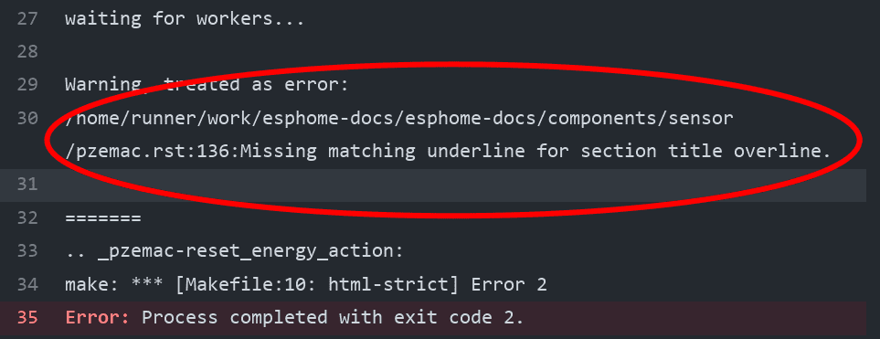

# Through Github

This guide essentially goes over the same material found in [GitHub\'s
Editing files in another user\'s repository
\<https://docs.github.com/en/repositories/working-with-files/managing-files/editing-files#editing-files-in-another-users-repository\>]{.title-ref}\_\_.
You may also find that page helpful to read.

At the bottom of each page in the docs, there is a \\"Edit this page on
GitHub\\" link. Click this link and you\\'ll see something like this:

{.align-center width="80.0%"}

Click the edit button to start making changes. If you\\'re not sure about
some element of syntax, see the quick-start
`rst-syntax`{.interpreted-text role="ref"} guide.

Once you\\'ve made your changes, give them a useful name and press
\\"Propose changes\\". At this point, you\\'ve made the changes on your own
personal copy of the docs in GitHub, but you still need to submit them
to us.

{.align-center width="80.0%"}

To do that, you need to create a \\"Pull request\\":

{.align-center width="80.0%"}

Fill out the new pull request form, replacing the [\[ \]]{.title-ref}
with [\[x\]]{.title-ref} to indicate that you have followed the
instructions.

{.align-center width="80.0%"}

After waiting a while, you might see a green or a red mark next to your
commit in your pull request:

{.align-center width="80.0%"}

This means that there is some error stopping your pull request from
being fully processed. Click on the X, click on \\"Details\\" next to the
lint step, and look and see what\\'s causing your change to fail.

{.align-center width="80.0%"}

{.align-center width="80.0%"}

For example, in this case, you\\'d want to go to line 136 of
[pzemac.rst]{.title-ref} and adjust the number of [===]{.title-ref} so
that it completely underlines the section heading.

Once you make that change, the pull request will be built again, and
hopefully this time where will be no other errors.
