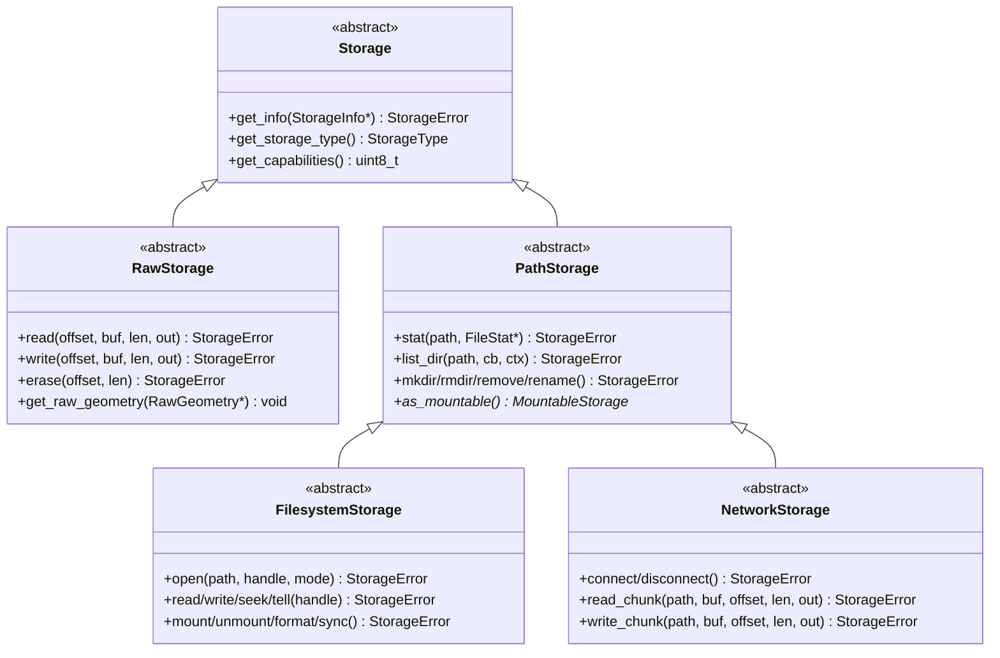

The `storage` component provides a shared interface and a runtime registry for storage devices. It is a *resource for
other components*: raw memory ICs, SD cards, USB mass storage and network shares all present the same API, so a
consumer written against one storage device works with every other one.

This page is for developers who either implement a storage driver or consume storage from another component. It does
not describe the YAML configuration; see the [user documentation](https://esphome.io/components/storage/) for that.

The component itself contributes no functionality on its own. Configuring `storage:` without a driver creates an empty
registry and nothing else.

> [!IMPORTANT]
> This interface is EXPERIMENTAL. The API may change at any time without following the normal breaking
> changes policy, so a driver or consumer built against it may need updating until it is marked stable.

## Class hierarchy



Which base class to derive from:

| Your device | Base class | Examples |
| --- | --- | --- |
| Offset-addressed bytes, no path namespace | `RawStorage` | EEPROM, FRAM, a raw flash partition |
| A file system with open file handles | `FilesystemStorage` | SD, USB MSC, LittleFS |
| A network protocol without handles | `NetworkStorage` | NFS |

`PathStorage` is the shared base of the latter two and exists so that path-oriented consumers — a file browser, a file
server, an image loader — can operate on any path-based storage without caring whether it is local or network-backed.
Do not derive from it directly.

A stateful network protocol that does have handles (SMB, for example) belongs under `FilesystemStorage`, not
`NetworkStorage`. The split is about the shape of the API, not about where the bytes physically live.

`MountableStorage` is a separate mix-in for media that come and go. A `PathStorage` returns it from `as_mountable()`
(default `nullptr`), which lets a consumer offer mount/unmount without knowing the concrete driver type. Override
`get_mount_caps()` to declare which of the two the driver actually supports (default both) — a medium that auto-mounts
on insertion reports unmount only, and a consumer's `mount`/`unmount` is gated on the matching bit.

## Implementing a driver

### Contracts you must honour

These are the rules a consumer is allowed to rely on. They are also documented inline in `storage.h`; this is the
summary.

**All calls are blocking.** There is no asynchronous behaviour anywhere in this interface. A driver method runs to
completion before it returns. Consumers are responsible for chunking and yielding — or for using the
[storage worker](#see-also), which does it for them.

**The registry is main-loop-only.** `register_storage()`, `unregister_storage()` and every `for_each*()` walker must
only be called from the main loop. A driver that learns about a device from a foreign task — a USB hotplug callback,
for instance — must defer the registration onto the main loop rather than calling directly.

**Registered means usable.** Call `register_storage()` as soon as the device can serve calls, and
`unregister_storage()` as soon as it stops being usable, before any teardown. Consumers treat presence in the registry
as permission to call.

**`get_info()` must succeed on an unmounted device** and report the state through `StorageInfo::is_mounted`. A consumer
listing available storages must be able to show a device that is present but not currently mounted, without the call
failing.

**Partial transfers are not errors.** `read()`/`write()` report what actually moved through their `bytes_transferred`
out-parameter and return `OK`. A read of zero bytes is EOF, not a failure.

**`list_dir()` must not emit `.` or `..`.** Its callback returns `bool`; returning `false` aborts enumeration early —
which is a normal outcome for a search or a paginated listing, so the call still returns `OK`.

**Data-plane calls on one instance are externally serialized.** The interface does not lock. If two callers could reach
the same instance concurrently, that is the caller's problem to solve, not yours.

### Capabilities

`get_capabilities()` returns a bitmask and defaults to `0`. The only capability today is `STORAGE_CAP_IO_TASK_SAFE`,
which declares that this instance's data-plane calls may run from a task other than the main loop.

Default to not reporting it. A driver that never considered task safety must never be treated as safe, and the default
guarantees that. Only report it when it holds for every instance the driver registers — a driver that owns its bus
exclusively can, one that shares a bus with unrelated devices cannot, because the answer then depends on how the user
wired the node rather than on your code.

### Registration lifecycle

```cpp
void MyStorage::setup() {
  if (this->init_hardware() != StorageError::OK) {
    this->mark_failed();
    return;
  }
  StorageError err = global_storage_registry->register_storage(this);
  if (err != StorageError::OK) {
    ESP_LOGE(TAG, "register failed: %s", error_to_string(err));
    this->mark_failed();
  }
}
```

`register_storage()` is idempotent and returns `NO_SPACE` when the registry is at its codegen-derived capacity. That
indicates a device-count mismatch between codegen and runtime and should be treated as fatal — running with an
invisibly missing device is worse than failing loudly.

For removable media there are two ways to withdraw a device:

- `unregister_storage()` removes the entry entirely. Use it when the device itself is gone (USB unplug).
- `quiesce_storage()` keeps the entry registered but performs the same drain. Use it when registration is permanent and
  only the *medium* comes and goes (SD safe-eject, NFS unmount). It avoids the log noise and the briefly-vanishing
  device that an unregister/re-register cycle produces.

Both are synchronous in an important sense: by the time they return, no consumer is still mid-call against the storage.
This is what makes "withdraw, then unmount" safe. Note that the guarantee is only as strong as the consumers
participating in it — in practice it is the storage worker that enforces it.

### Codegen

Your driver's `__init__.py` must depend on `storage` and announce itself during `to_code()`:

```python
from esphome.components import storage

DEPENDENCIES = ["storage"]

async def to_code(config):
    var = cg.new_Pvariable(config[CONF_ID])
    await cg.register_component(var, config)

    # Sizes the registry exactly — no compile-time upper bound.
    storage.request_storage_device()

    # The longest relative path this driver can carry. The API sizes its buffers to the
    # largest value any configured driver reports.
    storage.request_path_length(255)
```

Use `request_fatfs_path_length()` instead of `request_path_length()` if your bound is FATFS long filenames: that limit
is not a constant but whatever `CONFIG_FATFS_MAX_LFN` ends up being, and resolving it at codegen time means a user who
lowers it to save flash gets matching buffer sizes.

Set `setup_priority` so that your driver comes up after the registry, which uses `setup_priority::BUS`.

## Consuming storage

### Finding a device

Never hold a driver-specific pointer. Go through the registry:

```cpp
// Everything path-based, local or network — the usual entry point for a file consumer.
global_storage_registry->for_each_path_based([](PathStorage *s, void *ctx) {
  StorageInfo info{};
  if (s->get_info(&info) == StorageError::OK) {
    ESP_LOGD(TAG, "found %s at %s", info.name, s->get_mount_path());
  }
}, nullptr);
```

`for_each_filesystem()`, `for_each_raw()` and `for_each_network()` narrow it further, and a typed overload of
`for_each_path_based()` additionally hands the `StorageType` to the callback so you can distinguish local from network
without a virtual call per entry.

Each walker iterates a snapshot taken when the call starts, so a callback may register or unregister storages without
an entry being skipped, repeated, or read past the end. The flip side: a storage registered from inside a callback is
not visited until the next call.

To resolve a full VFS path to the device that owns it:

```cpp
const char *rel = nullptr;
PathStorage *s = global_storage_registry->resolve_path("/sd/logs/today.txt", &rel);
// s == the storage mounted at /sd, rel == "/logs/today.txt"
```

Matching is longest-prefix and only at a `/` boundary, so a mount point of `/sd` never swallows `/sd2/x`.
`StorageRegistry::build_path()` performs the inverse join.

### Indices are positions, not devices

`size()` and `get(index)` exist for callers that cannot use the walkers — work that must be spread across several main
loop passes, for example. Be aware that unregistration fills the freed slot by moving the last entry into it, so an
index held across a registration change may point at a different device. Hold the `Storage *` and ask `is_registered()`
if you need to know whether it is still the same device.

### Helpers

These are free functions, never implemented by drivers:

| Helper | Purpose |
| --- | --- |
| `exists()`, `file_size()` | Cheap existence and size queries |
| `read_file()`, `write_file()` | Whole-file convenience into/from a `RamBuffer` |
| `copy()` | Streaming copy, works across devices |
| `move()` | Same-storage `rename()` fast path, cross-storage copy + remove |
| `remove_recursive()` | Depth-limited tree removal; drivers only implement `rmdir()` |
| `error_to_string()`, `error_from_errno()` | Consistent logging and errno mapping |

`read_file()` and `write_file()` are overloaded on `PathStorage *` as well as on the concrete subtypes, so a generic
consumer never has to dispatch on `get_storage_type()` itself.

### The blocking guard-rail

`read_file()`, `write_file()`, `copy()` and `move()` hold the whole payload in RAM and block for its duration. The
registry's `max_blocking_transfer_size` rejects anything larger with `TRANSFER_TOO_LARGE` rather than letting a node
freeze. Handle that error by routing the transfer through the worker instead of by raising the limit.

### Hotplug

```cpp
global_storage_registry->add_on_registered_callback([](Storage *s) { /* ... */ });
global_storage_registry->add_on_unregistered_callback([](Storage *s) { /* ... */ });
```

Both are templatized so a lightweight forwarder struct is accepted without heap allocation, following the same
callback-method pattern as other ESPHome triggers. The underlying `LazyCallbackManager` costs 4 bytes until the first
subscriber, so components that never listen pay almost nothing.

## Error codes

`StorageError` values mirror their closest POSIX `errno` equivalent, so the numeric values are meaningful against
familiar codes. Drivers still return `StorageError`, not `int`.

| Value | Meaning |
| --- | --- |
| `OK` | Success — including a partial transfer and an early `list_dir()` abort |
| `NOT_FOUND`, `ALREADY_EXISTS`, `NOT_EMPTY` | Path-level outcomes |
| `READ_ERROR`, `WRITE_ERROR`, `CORRUPT` | Medium-level failures |
| `NO_SPACE`, `TOO_MANY_OPEN_FILES` | Resource exhaustion |
| `NOT_READY` | Device present but not usable yet (unmounted, still connecting) |
| `NOT_SUPPORTED` | The operation does not exist on this medium |
| `TRANSFER_TOO_LARGE` | Rejected by the blocking guard-rail |
| `INVALID_ARGS`, `PERMISSION_DENIED`, `TIMEOUT` | As their names suggest |

Always report through `error_to_string()` so logs stay consistent across drivers.

## Compile-time defines

| Define | Set from |
| --- | --- |
| `USE_STORAGE` | Always, when the component is configured |
| `USE_STORAGE_MAX_DEVICES` | Exact configured device count |
| `USE_STORAGE_PATH_MAX` | Largest path bound any driver reported |
| `USE_STORAGE_VFS_PATH_MAX` | Full VFS path bound: `path_max` plus the longest configured mount point |
| `USE_STORAGE_MAX_RECURSION_DEPTH` | Tree-walk depth limit |
| `USE_STORAGE_COPY_CHUNK_SIZE` | Streaming chunk size |
| `USE_STORAGE_CHANGE_FEED` | Optional directory-change feed |
| `USE_STORAGE_DEVICE_NODES` | Raw devices exposing a device node name |

`STORAGE_PATH_MAX` and friends have compile-time fallbacks in `storage.h`, so code including the header outside a full
codegen run — unit tests, static analysis — still compiles.

## See also

- [Storage Worker](/architecture/components/storage_worker/) — the async engine for chunked and non-blocking transfers
- [Implementing Automations](/architecture/components/automations/) — for exposing operations to YAML
- [Component architecture](/architecture/components/) — general component structure
